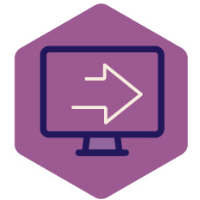

# Move Integrasjonspunkt v3



## Føremål
Integrasjonspunkt er ein del av eFormidling og fungerer som eit knutepunkt for trygg og sikker utveksling av elektroniske dokument offentlege etatar seg i mellom, samt mellom offentlege og private verksemder i Noreg.

## Teknologiar i bruk
- Spring Boot
- Maven
- Java 21+

## Oppstart
### Føresetnadar

- Java 21
- Maven 3+

Lag egen lokale konfigurasjonsfil i roten av prosjektet med navn `integrasjonspunkt-local.properties`
(alternativt `integrasjonspunkt-local.yml` eller `integrasjonspunkt-local.yaml`).  Den vil bli inkludert
automatisk når du starter en av de forhåndsdefinerte maven-profilene (som `staging`, `dev`, `prod`). 
Det ligger en [sample.properties](integrasjonspunkt-local.sample.properties) fil i dette prosjektet som vise eksempler på konfig,
for mer detaljer sjekk dokumentasjonen https://docs.digdir.no/docs/eFormidling/installasjon/installasjon

### Bygging
```bash
mvn clean package

# start med staging profil (som også leser fra din lokale konfigurasjonsfil) :
java -Dspring.profiles.active=staging -jar integrasjonspunkt/target/integrasjonspunkt.jar
```

For å bygge API dokumentasjon samtidig og sjekke den i lokal nettleser bruk profil `restdocs` :
```bash
mvn clean package -Prestdocs
open integrasjonspunkt/target/generated-docs/restdocs.html
```


## Grensesnitt

Ekstern dokumentasjon finnes her : https://docs.digdir.no/docs/eFormidling/

### Lokale endepunkter
Webside der man kan kikke på og slette konversasjoner :
- http://localhost:9093/conversations
- http://localhost:9093/viewreceipts  🚨 Ikke i bruk / kan fjernes ? 🚨

En API funksjon som er lett å teste i nettleser :
- http://localhost:9093/api/statuses

Linker til observability :
http://localhost:9093/manage/info
- http://localhost:9093/manage/health
- http://localhost:9093/manage/health/liveness
- http://localhost:9093/manage/health/readiness
- http://localhost:9093/manage/metrics
- http://localhost:9093/manage/prometheus

Linker til logger, config og alt annet :
- http://localhost:9093/manage/logfile
- `curl http://localhost:9093/manage | jq` (lister over alle observability endpoints)
- `curl http://localhost:9093/manage/configprops | jq`
- `curl http://localhost:9093/manage/configprops/difi.move | jq` (kun `difi.move` konfig)

## Release
Sjå dokumentasjon for [maven-release-plugin](https://maven.apache.org/maven-release/maven-release-plugin/) og [guide for maven-release-plugin](https://maven.apache.org/guides/mini/guide-releasing.html).

```bash
# lokalt repo må være i sync med origin/GitHub
git push

mvn release:prepare
# svar på tre spørsmål (sett tag lik release-versjon) 
# What is the release version for "efm-virksert"? (no.difi.meldingsutveksling:efm-virksert) 1.0: : 1.0.0
# What is SCM release tag or label for "efm-virksert"? (no.difi.meldingsutveksling:efm-virksert) 1.0.0: :
# What is the new development version for "efm-virksert"? (no.difi.meldingsutveksling:efm-virksert) 1.0.1-SNAPSHOT: :

mvn release:perform
```


