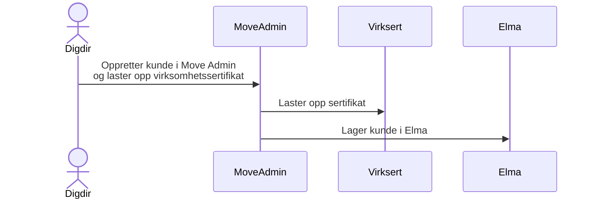
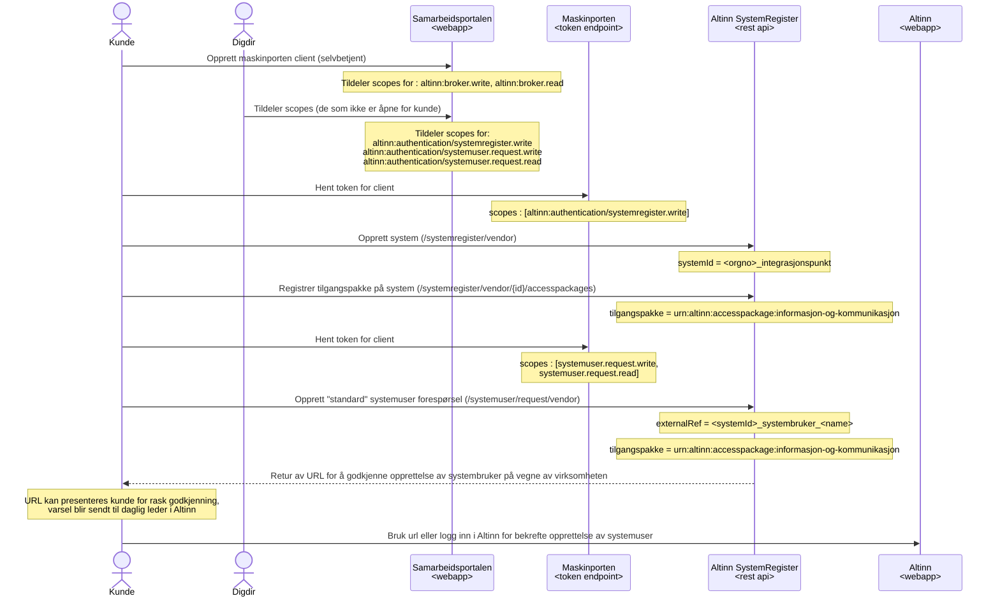
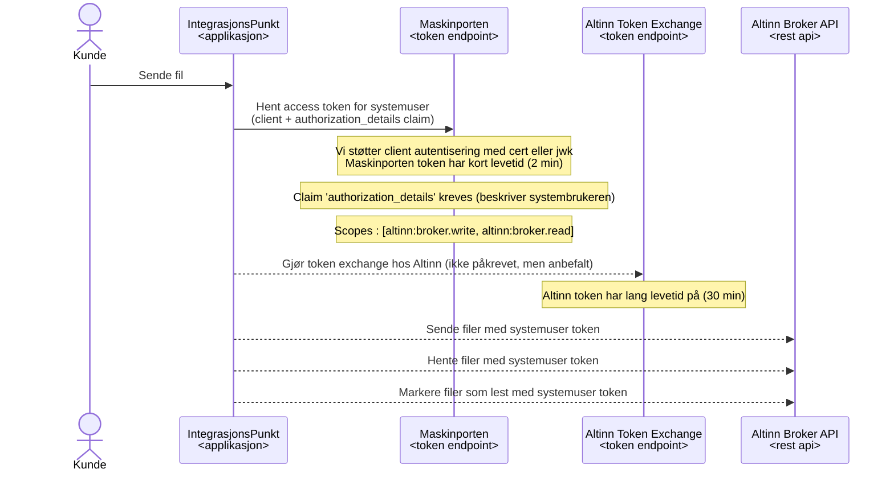

# Slik fungerer DPO løsningen med Altinn v3 
Bakgrunn og overordnet er beskrevet av Altinn i JIRA saken :
https://github.com/Altinn/altinn-authentication/issues/1394

## Onboarding av virksomhet til DPO med Integrasjonspunktet

Kunden må onboardes i eformidling miljøet

Kunden må lage en maskinporten client (med nødvendige scopes),
registrere ett system for sitt integrasjonspunkt og opprette
en systemuser som kan benyttes av integrasjonspunktet for å
sende og motta filer via Altinn Broker API.

Sekvensen er beskrevet nedenfor, stegne kan gjøres via Altinn v3 API'er med det utvikles også et [GUI for dette](https://am.ui.tt02.altinn.no/accessmanagement/ui/systemuser/overview). 

## Bruk av systemuser for å sende og motta filer via broker tjenesten
Broker tjenesten kan sende og motta filer.  For å benytte den må man ha en systemuser
med korrekt tilgangspakke.  Det er en policy på Digdir's broker ressurs som begrenser
bruken til systemusers med tilgangspakke `urn:altinn:accesspackage:informasjon-og-kommunikasjon`.

Henting av filer er basert på polling, det er ikke støtte for webhook/notification
i denne versjonen (selv om det finnes Altinn API'er for dette).

