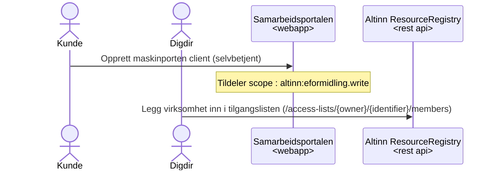
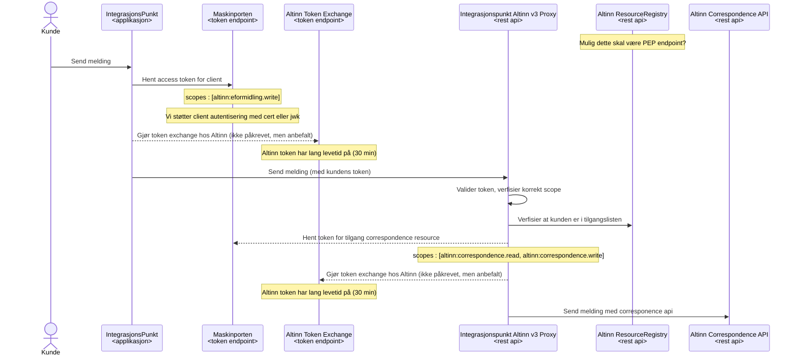

# Slik fungerer DPV løsningen med Altinn v3
Bakgrunn og overordnet er beskrevet av Altinn i JIRA saken :
https://github.com/Altinn/altinn-authentication/issues/1395

## Onboarding av virksomhet til DPV med Integrasjonspunktet
Kunden må lage en maskinporten client (med nødvendige scopes),
deretter må Digdir legge til virksomheten i tilgangslisten
på correspondence ressursen i Altinn.

Forutsetter at nytt scope `altinn:eformidling.write` er opprette og tilgjengelig for kunden. 

## Bruk av correspondence tjenesten
Nedenfor vises flyten for å sende en melding.
Flyten er lik enten det er en åpen eller taushetsbelagt melding.

