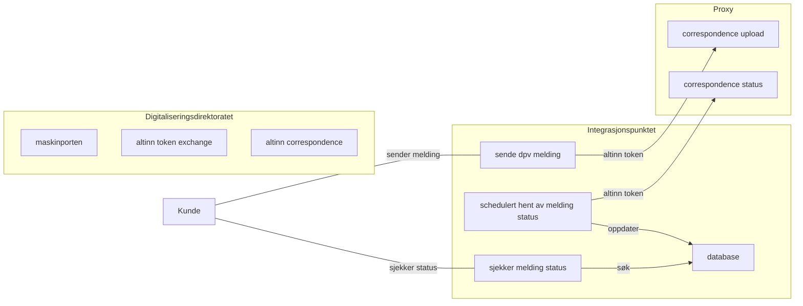

# Altinn v3 Proxy
En spring boot cloud gateway applikasjon som proxier correspondence api requests videre til Altinn 3.

Proxyen har følgende formål :
- [ ] Autentisere client requests fra Integrasjonspunkter hos kundene (gyldig maskinporten token)
- [ ] Autorisere client requests ved å verifisere scope på token og sjekke tilgangslisten på ressursen i Altinn 3
- [ ] Påføre vårt eget access token for å kunne utføre requests på vegne av kunden



## TODO videre utvikling :
- [ ] Flere tester som tester selve filteret (nå er hele kjeden mocket)
- [ ] Kan flyttes ut i et selvstendig repo (enklere deployment og separat release takt)
- [ ] Har ikke behov for å kjøre på samme versjon av Java / Spring Boot som Integrasjonspunktet

## Bygges og kjøres
```bash
mvn clean package
java -jar altinn-v3-proxy/target/altinn-v3-proxy.jar
```

