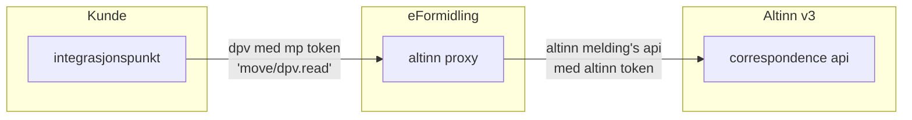
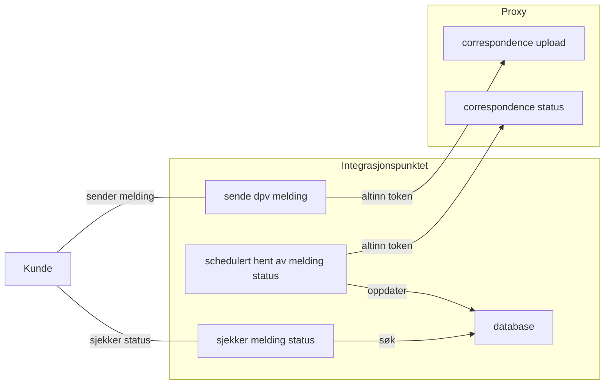

# Altinn v3 Proxy
En spring boot cloud gateway applikasjon som proxier correspondence api requests videre til Altinn 3.

Proxyen har følgende formål :
- [ ] Autentisere client requests fra Integrasjonspunkter hos kundene (gyldig maskinporten token)
- [ ] Autorisere client requests ved å verifisere scope på token og sjekke tilgangslisten på ressursen i Altinn 3
- [ ] Påføre vårt eget access token for å kunne utføre requests på vegne av kunden

## High level oversikt


## Hva gjør integrasjonspunktet?


## TODO videre utvikling :
- [ ] Flere tester som tester selve filteret (nå er hele kjeden mocket)
- [ ] Kan flyttes ut i et selvstendig repo (enklere deployment og separat release takt)
- [ ] Har ikke behov for å kjøre på samme versjon av Java / Spring Boot som Integrasjonspunktet

## Bygges og kjøres (fra root av repo)
```bash
mvn clean package
java -jar altinn-v3-proxy/target/altinn-v3-proxy-3.5.5.jar
```

## Lage image med buildpacks (fra root av repo)
```bash
mvn clean package -Dmaven.test.skip=true -pl altinn-v3-proxy -am spring-boot:build-image -Dspring-boot.build-image.imageName=my-local-registery/altinn-v3-proxy:2025-09-06-1501-14a43cb6 -Dspring-boot.build-image.builder=paketobuildpacks/builder-jammy-tiny

# run the image
docker run -p 8080:8080 --name altinn-v3-proxy docker.io/my-local-registery/altinn-v3-proxy:2025-09-06-1501-14a43cb6

# test the image (call open api function thru proxy) :
http https://platform.tt02.altinn.no/resourceregistry/api/v1/resource/resourcelist

curl -i -H "Authorization: Bearer <token med rett scope>" \
http://localhost:8080/resourceregistry/api/v1/resource/resourcelist

http http://localhost:8080/resourceregistry/api/v1/resource/resourcelist
```
