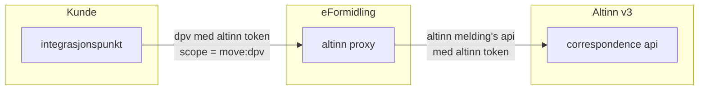
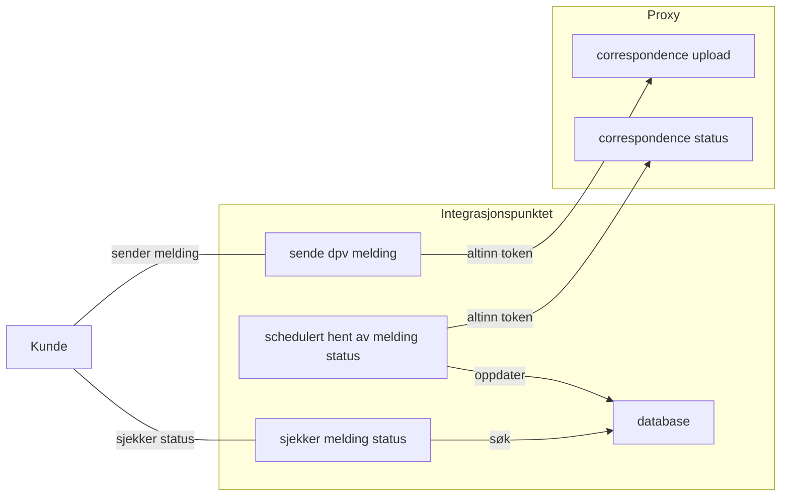

# Altinn v3 Proxy
En spring boot cloud gateway applikasjon som proxier correspondence api requests videre til Altinn 3.

Proxyen har følgende formål :
- [x] Autentisere client requests fra Integrasjonspunkter hos kundene (gyldig maskinporten token)
- [x] Autorisere client requests ved å verifisere scope på token og sjekke tilgangslisten på ressursen i Altinn 3
- [x] Påføre vårt eget access token for å kunne utføre requests på vegne av kunden

## High level oversikt


## FIXME og TODO for videre utvikling :
- [x] Flere tester som tester selve filteret (nå er hele kjeden mocket)
- [x] Caching av access token satt til 25 minutter (Altinn tokens har 30 minutters levetid)
- [x] Flytte actuator til / på 8090
- [x] Lage et opplegg for ytelsestesting av proxyen MOVE-4639
- [x] Legge til metrics for token cache (cache type) (`eformidling.dpv.proxy.token`)
- [x] Legge til metrics for forward/ping requests (`eformidling.dpv.proxy.request`)
- [x] Proxy requests autentiseres med altinn token (lang levetid, Roar mente altinn token var tingen)
- [ ] Bytte ut `SCOPE_altinn:broker.read` med `SCOPE_eformidling:dpv` se [MOVE-4549](https://digdir.atlassian.net/browse/MOVE-4549) og [MOVE-4588](https://digdir.atlassian.net/browse/MOVE-4588)
- [ ] Må vi legge inn sperrer sånn at proxy ikke kan benyttes til å hente ut vedlegg / metadata fra correspondence api?
- [ ] Se på policy på ressuren igjen (kan vi kvitte oss med `altinn:serviceowner`, eller er det sikkerhetsmessig fornuftig å beholde dette?)
- [ ] Vurdere en ekstra custom metric for `eformidling.dpv.proxy.errors`
- [ ] Lage et grafana dashboard for proxy hvor vi kan følge med på bruken
- [ ] Actuator paths er åpne på både web og mgmt port (kan dette splittes i 2 security filter, en for hver port)
- [ ] [MOVE-4641](https://digdir.atlassian.net/browse/MOVE-4641) : Flyttes ut i et selvstendig repo (enklere deployment og separat release takt)
- [ ] Har ikke behov for å kjøre på samme versjon av Java / Spring Boot som Integrasjonspunktet (oppgradere til Java 25)

## Deployment

| Miljø                                                                                                                     | URL som skal benyttes i Integrasjonspunktet                                  | Forklaring                                  |
|---------------------------------------------------------------------------------------------------------------------------|------------------------------------------------------------------------------|---------------------------------------------|
| [PROD](https://github.com/felleslosninger/eformidling-cd/tree/main/apps/eformidling/prod/efm-integrasjonspunkt-dpv-proxy) |                                                                              | Produksjon går mot Altinn produksjon     |
| [TEST](https://github.com/felleslosninger/eformidling-cd/tree/main/apps/eformidling/test/efm-integrasjonspunkt-dpv-proxy) | https://dpvproxy.apps.kt.digdir.cosng.net/altinn-proxy/correspondence/api/v1 | Kundetest er konfigurert mot Altinn v3 TT02 |
| [DEV](https://github.com/felleslosninger/eformidling-cd/tree/main/apps/eformidling/dev/efm-integrasjonspunkt-dpv-proxy)   | https://eformidling.dev/altinn-proxy/correspondence/api/v1                   | Systest er konfigurert mot Altinn v3 TT02   |

## Observability

- Logging er JSON til stdout (logback format), leses inn i Eleastic og kan søkes i Kibana.
- Metrics er PROMETHEUS, leses inn i Prometheus og visualiseres i Grafana.

Proxy har noen custom metrics som starter med `eformidling.dpv.proxy.*`, disse er :
- `eformidling.dpv.proxy.request { type=forward, method=GET|POST } ` (teller proxy requests, tagget med http methode)
- `eformidling.dpv.proxy.request { type=ping,    method=GET|POST } ` (teller ping requests, tagget med http methode)
- `eformidling.dpv.proxy.token { type= maskinporten | altinn }` (teller antall tokens generert, tagget med type) 

## Bygges og kjøres lokalt (fra root av repo)
```bash
mvn clean package

# for å starte med virksomhets sertifikat liggende i ENV variabler :
export OIDC_KEYSTORE_PATH=base64:$(base64 -i /Users/thorej/src/2023-cert-test-virks/eformidling-test-auth.jks)
export OIDC_KEYSTORE_PASSWORD='TopSecretPasswordHere'
java -jar altinn-v3-proxy/target/altinn-v3-proxy-1.0.0.jar

# for å starte med lokal properties fil :
java -jar altinn-v3-proxy/target/altinn-v3-proxy-1.0.0.jar --spring.config.additional-location=./altinn-v3-proxy/application-thjo.properties
java -jar altinn-v3-proxy/target/altinn-v3-proxy-1.0.0.jar --debug --spring.config.additional-location=./altinn-v3-proxy/application-thjo.properties
```

## Trigge bygging og testing nytt docker image fra en branch
Det er mulig å trigge nytt docker image fra en branch ved å angi teksten `[docker]` i git commit meldingen.

```bash
# tom commit for å trigge nytt docker image build
git commit --allow-empty -m "Trigger [docker] bygg igjen"
git push

# log inn til azure container registry (om du ikke allerede er innlogget)
az login
az acr login --name creiddev

# list which images are available
az acr repository show-manifests --name creiddev --repository efm-integrasjonspunkt-dpv-proxy --output table
az acr repository show-manifests --name creiddev --repository efm-integrasjonspunkt-dpv-proxy --output json

# når build-dpv-proxy.yaml har bygget og pushet kan du starte noe slikt :

export OIDC_KEYSTORE_PATH=base64:$(base64 -i /Users/thorej/src/2023-cert-test-virks/eformidling-test-auth.jks)
export OIDC_KEYSTORE_PASSWORD='TopSecretPasswordHere'
docker run -p 8080:8080 --name dpv-proxy --rm \
-e OIDC_KEYSTORE_PATH=$OIDC_KEYSTORE_PATH -e OIDC_KEYSTORE_PASSWORD=$OIDC_KEYSTORE_PASSWORD \
creiddev.azurecr.io/efm-integrasjonspunkt-dpv-proxy:2025-10-10-1431-109c8575 --debug

export KEYSTORE_FILE=/Users/thorej/src/2023-cert-test-virks/eformidling-test-auth.jks
docker run -p 8080:8080 --name dpv-proxy --rm -v $KEYSTORE_FILE:$KEYSTORE_FILE \
-e OIDC_KEYSTORE_PATH=file:$KEYSTORE_FILE -e OIDC_KEYSTORE_PASSWORD=PasswordToKeystore \
creiddev.azurecr.io/efm-integrasjonspunkt-dpv-proxy:2025-10-10-1431-109c8575 --debug

# alternativt med alle properties i en lokal fil som du mounter inn slik :
export KEYSTORE_FILE=/Users/thorej/src/2023-cert-test-virks/eformidling-test-auth.jks
export CONFIG_FILE=/Users/thorej/src/efm-integrasjonspunkt/altinn-v3-proxy/application-thjo.properties
docker run -p 8080:8080 --name dpv-proxy --rm -v $KEYSTORE_FILE:$KEYSTORE_FILE -v $CONFIG_FILE:$CONFIG_FILE \
creiddev.azurecr.io/efm-integrasjonspunkt-dpv-proxy:2025-10-10-1431-109c8575 \
--spring.config.additional-location=$CONFIG_FILE --debug
```

## Lage image med buildpacks (manuelt fra root av repo)
```bash
mvn clean package -Dmaven.test.skip=true -pl altinn-v3-proxy -am spring-boot:build-image -Dspring-boot.build-image.imageName=my-local-registery/altinn-v3-proxy:2025-09-06-1501-14a43cb6 -Dspring-boot.build-image.builder=paketobuildpacks/builder-jammy-tiny

# run the image
docker run -p 8080:8080 --name altinn-v3-proxy docker.io/my-local-registery/altinn-v3-proxy:2025-09-06-1501-14a43cb6

# test the image (call open api function thru proxy) :
http https://platform.tt02.altinn.no/resourceregistry/api/v1/resource/resourcelist

curl -i -H "Authorization: Bearer <token med rett scope>" \
http://localhost:8080/resourceregistry/api/v1/resource/resourcelist

http http://localhost:8080/resourceregistry/api/v1/resource/resourcelist
```

## Ytelsestesting av proxy'en

Vi har laget et [K6 loadtest opplegg](k6/loadtest-tt02.js) for ytelsestesting av proxy'en basert på [K6](https://k6.io).
Slike K6 tester kan kjøres lokalt eller i CI/CD pipeline.
- Lokalt benyttes K6 cli eller K6 container image (slipper å grise ned egen maskin med installasjon av K6).
- For å kjøre i CI/CD pipeline kjører man K6 fra github actions.

Proxy'en har ett dedikert `ping` endepunkt for ytelsestesting, det krever maskinporten token på samme måte som correcpondence api, men videreformidler ikke request til Altinn.
For å simulere litt last vil endepunktet vente angitt tid og returnere spesifisert mengde data, dermed har vi mulighet til å teste paralellitet og ytelse.


| Endepunkt (eksempel)   | Beskrivelse                                           |
|------------------------|-------------------------------------------------------|
| /altinn-proxy/ping                  | Returnerer json med meldingen "pong" umiddelbart      |
| /altinn-proxy/ping?wait=1000        | Venter 1000ms og returnerer json med meldingen "pong" |
| /altinn-proxy/ping?size=32768       | Returnerer json med 32768 random bokstaver i meldingen |
| /altinn-proxy/ping?wait=1000&size=32768 | Venter 1000ms før den returnerer json med 32768 random bokstaver i meldingen |

Ping endepunktet benyttes i [loadtest-tt02.js](k6/loadtest-tt02.js) og angir en kort wait og en ikke så altfor stor size.

Før man kan kjøre loadtest må man ha ett Maskinporten token med rett scope. Tokenet må være lagret i en miljøvariabel som heter TOKEN.

I testene for [altinn-v3-client](../altinn-v3-client) finnes det noen manuelle tester som kan benyttes for å hente ut et token.
Alternativt kan man bruke [jwt-grant-generator](https://github.com/felleslosninger/jwt-grant-generator). 

```bash
# To run with locally installed K6
export TOKEN=xxxxx
k6 run loadtest-tt02.js

# To run using Docker use K6 container image
export TOKEN=xxxxx
docker run --rm -i -e "TOKEN=$TOKEN" -v "$(pwd)/altinn-v3-proxy/k6/loadtest-tt02.js:/loadtest-tt02.js:ro" grafana/k6 run /loadtest-tt02.js
```

## Når benytter integrasjonspunktet proxy'en? 



