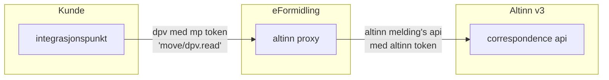
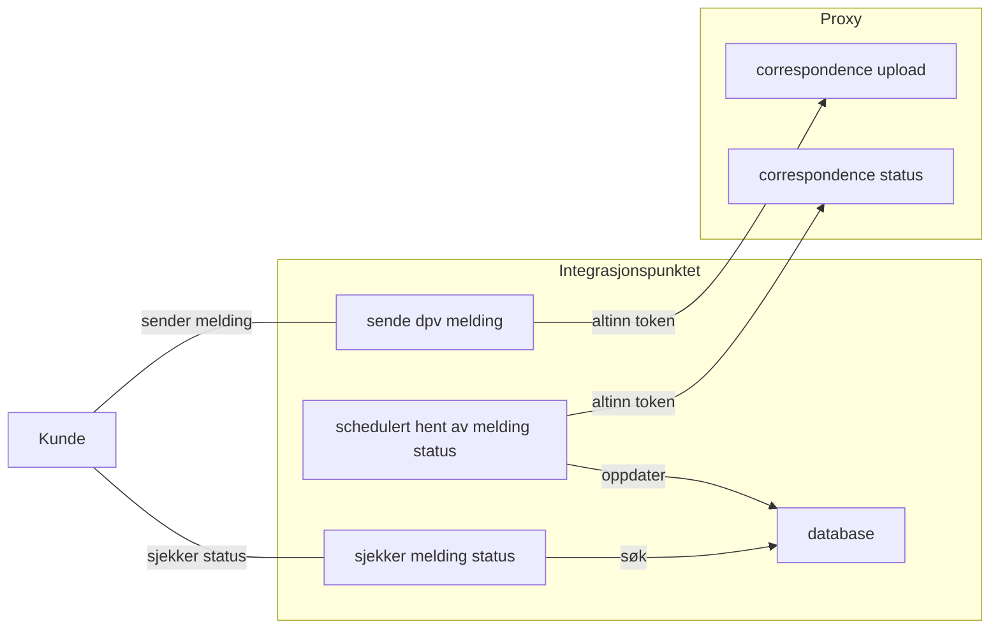

# Altinn v3 Proxy
En spring boot cloud gateway applikasjon som proxier correspondence api requests videre til Altinn 3.

Proxyen har følgende formål :
- [x] Autentisere client requests fra Integrasjonspunkter hos kundene (gyldig maskinporten token)
- [x] Autorisere client requests ved å verifisere scope på token og sjekke tilgangslisten på ressursen i Altinn 3
- [x] Påføre vårt eget access token for å kunne utføre requests på vegne av kunden

## High level oversikt


## TODO videre utvikling :
- [x] Flere tester som tester selve filteret (nå er hele kjeden mocket)
- [ ] Bytte ut `SCOPE_altinn:broker.read` med noe mer fornuftig
- [ ] Se på policy på ressuren igjen (kan vi kvitte oss med `altinn:serviceowner`, eller er det sikkerhetsmessig fornuftig å ha det?)
- [ ] Kan flyttes ut i et selvstendig repo (enklere deployment og separat release takt)
- [ ] Har ikke behov for å kjøre på samme versjon av Java / Spring Boot som Integrasjonspunktet (Java 25?)

## Bygges og kjøres (fra root av repo)
```bash
mvn clean package
java -jar altinn-v3-proxy/target/altinn-v3-proxy-3.5.5.jar
```

## Trigge og teste nytt docker image fra en branch
Det er mulig å trigge nytt docker image fra en branch ved å angi teksten `[docker]` i git commit meldingen.

```bash
# tom commit for å trigge nytt docker image build
git commit --allow-empty -m "Trigger [docker] bygg igjen"
git push

# log inn til azure container registry (om du ikke allerede er innlogget)
az login
az acr login --name creiddev

# når build-dpv-proxy.yaml har bygget og pushet docker image kan det kjøres
docker run -p 8080:8080 --name dpv-proxy creiddev.azurecr.io/efm-integrasjonspunkt-dpv-proxy:2025-10-08-1216-7d8d61fe
```

## Lage image med buildpacks (manuelt fra root av repo)
```bash
mvn clean package -Dmaven.test.skip=true -pl altinn-v3-proxy -am spring-boot:build-image -Dspring-boot.build-image.imageName=my-local-registery/altinn-v3-proxy:2025-09-06-1501-14a43cb6 -Dspring-boot.build-image.builder=paketobuildpacks/builder-jammy-tiny

# run the image
docker run -p 8080:8080 --name altinn-v3-proxy docker.io/my-local-registery/altinn-v3-proxy:2025-09-06-1501-14a43cb6

# test the image (call open api function thru proxy) :
http https://platform.tt02.altinn.no/resourceregistry/api/v1/resource/resourcelist

curl -i -H "Authorization: Bearer <token med rett scope>" \
http://localhost:8080/resourceregistry/api/v1/resource/resourcelist

http http://localhost:8080/resourceregistry/api/v1/resource/resourcelist
```

## Når benytter integrasjonspunktet proxy'en? 



