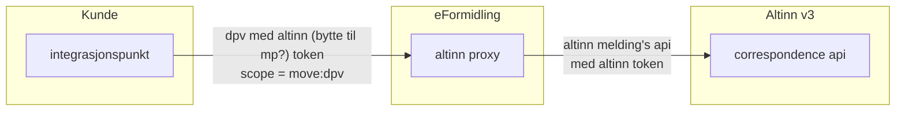
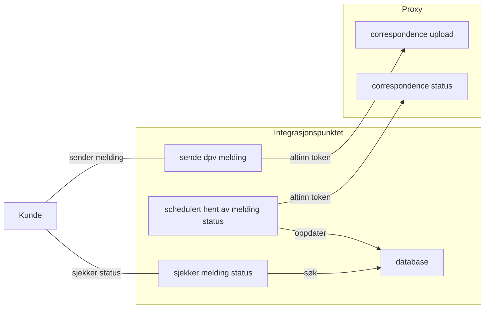

# Altinn v3 Proxy
En spring boot cloud gateway applikasjon som proxier correspondence api requests videre til Altinn 3.

Proxyen har følgende formål :
- [x] Autentisere client requests fra Integrasjonspunkter hos kundene (gyldig maskinporten token)
- [x] Autorisere client requests ved å verifisere scope på token og sjekke tilgangslisten på ressursen i Altinn 3
- [x] Påføre vårt eget access token for å kunne utføre requests på vegne av kunden

## High level oversikt


## FIXME og TODO for videre utvikling :
- [x] Flere tester som tester selve filteret (nå er hele kjeden mocket)
- [x] Caching av access token satt til 25 minutter (Altinn tokens har 30 minutters levetid)
- [ ] Bytte ut `SCOPE_altinn:broker.read` med noe mer fornuftig
- [ ] Skal proxy requests autentiseres med altinn token (lang levetid) eller kun maskinporten token (kort levetid) (Roar mente altinn token var tingen)
- [ ] Se på policy på ressuren igjen (kan vi kvitte oss med `altinn:serviceowner`, eller er det sikkerhetsmessig fornuftig å beholde dette?)
- [ ] Kan flyttes ut i et selvstendig repo (enklere deployment og separat release takt)
- [ ] Har ikke behov for å kjøre på samme versjon av Java / Spring Boot som Integrasjonspunktet (Java 25?)

## Bygges og kjøres (fra root av repo)
```bash
mvn clean package
java -jar altinn-v3-proxy/target/altinn-v3-proxy-1.0.0.jar

# for å starte med din egen properties fil
java -jar altinn-v3-proxy/target/altinn-v3-proxy-1.0.0.jar --spring.config.additional-location=./altinn-v3-proxy/application-thjo.properties
java -jar altinn-v3-proxy/target/altinn-v3-proxy-1.0.0.jar --debug --spring.config.additional-location=./altinn-v3-proxy/application-thjo.properties
```

## Trigge og teste nytt docker image fra en branch
Det er mulig å trigge nytt docker image fra en branch ved å angi teksten `[docker]` i git commit meldingen.

```bash
# tom commit for å trigge nytt docker image build
git commit --allow-empty -m "Trigger [docker] bygg igjen"
git push

# log inn til azure container registry (om du ikke allerede er innlogget)
az login
az acr login --name creiddev

# når build-dpv-proxy.yaml har bygget og pushet kan du starte noe slikt :
export KEYSTORE_FILE=/Users/thorej/src/2023-cert-test-virks/eformidling-test-auth.jks
docker run -p 8080:8080 --name dpv-proxy --rm -v $KEYSTORE_FILE:$KEYSTORE_FILE \
-e OIDC_KEYSTORE_PATH=file:$KEYSTORE_FILE -e OIDC_KEYSTORE_PASSWORD=PasswordToKeystore \
creiddev.azurecr.io/efm-integrasjonspunkt-dpv-proxy:2025-10-09-1242-4a2113f0 --debug

# alternativt med alle properties i en lokal fil som du mounter inn slik :
export KEYSTORE_FILE=/Users/thorej/src/2023-cert-test-virks/eformidling-test-auth.jks
export CONFIG_FILE=/Users/thorej/src/efm-integrasjonspunkt/altinn-v3-proxy/application-thjo.properties
docker run -p 8080:8080 --name dpv-proxy --rm -v $KEYSTORE_FILE:$KEYSTORE_FILE -v $CONFIG_FILE:$CONFIG_FILE \
creiddev.azurecr.io/efm-integrasjonspunkt-dpv-proxy:2025-10-09-1242-4a2113f0 \
--spring.config.additional-location=$CONFIG_FILE --debug
```

## Lage image med buildpacks (manuelt fra root av repo)
```bash
mvn clean package -Dmaven.test.skip=true -pl altinn-v3-proxy -am spring-boot:build-image -Dspring-boot.build-image.imageName=my-local-registery/altinn-v3-proxy:2025-09-06-1501-14a43cb6 -Dspring-boot.build-image.builder=paketobuildpacks/builder-jammy-tiny

# run the image
docker run -p 8080:8080 --name altinn-v3-proxy docker.io/my-local-registery/altinn-v3-proxy:2025-09-06-1501-14a43cb6

# test the image (call open api function thru proxy) :
http https://platform.tt02.altinn.no/resourceregistry/api/v1/resource/resourcelist

curl -i -H "Authorization: Bearer <token med rett scope>" \
http://localhost:8080/resourceregistry/api/v1/resource/resourcelist

http http://localhost:8080/resourceregistry/api/v1/resource/resourcelist
```

## Når benytter integrasjonspunktet proxy'en? 



