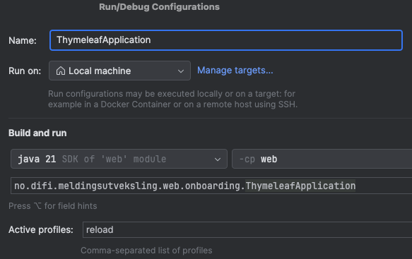

# Integrasjonspunkt Web Application

The web application is separated into a separate module from the rest-api and backend code.
That way it is easier to develop and test the web application without having to start the full Integrasjonspunkt with it's rest-api and dependencies to queue, database etc.

## HotReload development from IntelliJ
Just right click the [ThymeleafApplication.java](src/main/java/no/difi/meldingsutveksling/web/onboarding/ThymeleafApplication.java) and run it.
You should also set the run configuration to use the `reload` profile (so that it uses the [application-reload.properties](src/main/resources/application-reload.properties) file).



## HotReload development from command line
Easiest would be cd-into the web module and use maven from there like this :
```bash
cd web
mvn spring-boot:run -Dspring-boot.run.profiles=reload
```
This will read the correct properties file and start the application in hot reload mode.

> [!WARNING] 
> You will need to instruct your editor to automatically rebuild the changes for automatic reload to work.
> Since reload works by scanning the compiled output, just changing the sources will not trigger a reload.
